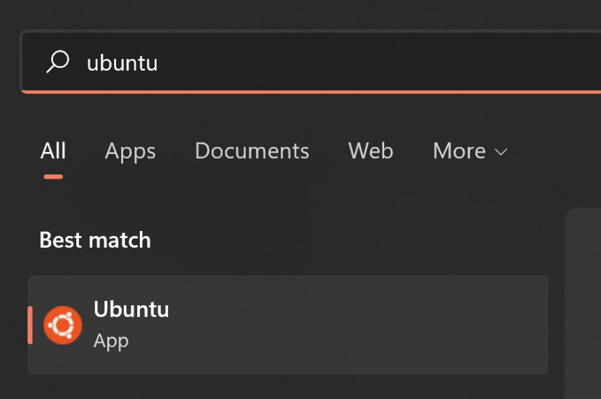
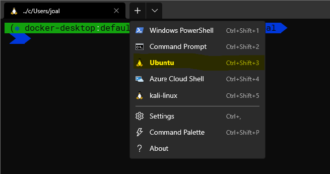
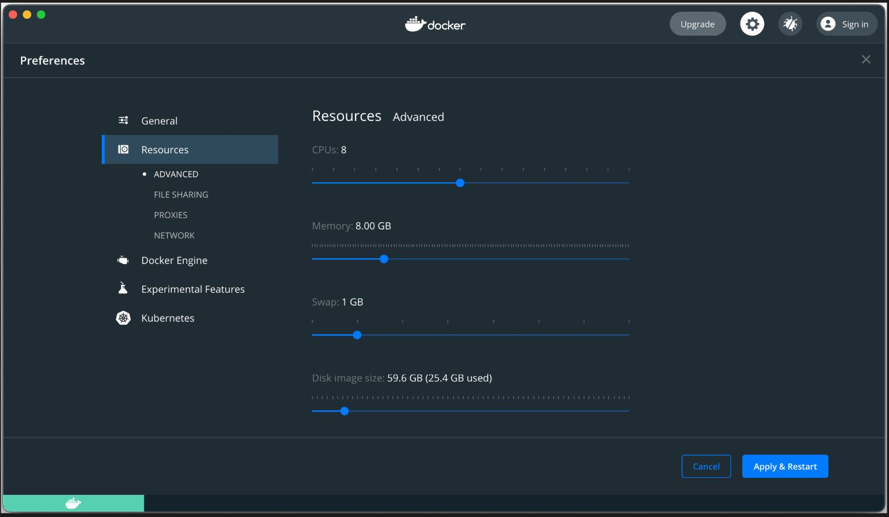

# Kafka Training Environment
[⬅️ Back to Kafka overview](README.md)

## Training environment
This training comes with a predefined environment provided in multiple docker containers. 

## Windows with WSL 2.0 & Mac: Start the training environment
Open a shell and run the following commands to check out the course repository and start the environment.
```
git clone https://github.com/lfrei/kafka-training.git
cd kafka-training
docker-compose up -d
```

💡 Detailed instruction to **fulfill all system requirements** are described further down.
💡 If  Git is need to be installed on Ubuntu use the following command: 
```
sudo apt install -y git
```

Verification
To check things are up and running, execute the following command. There should be a list of running containers. The status should be up and healthy for all containers.
```
docker ps

Example output
CONTAINER ID   IMAGE                                        COMMAND                  CREATED      STATUS                PORTS
NAMES
a9308b57635b   tchiotludo/akhq                              "docker-entrypoint.s…"   6 days ago   Up 5 days             0.0.0.0:8080->8080/tcp
kafka-training_akhq_1
b31ceaeefe17   confluentinc/ksqldb-examples:6.2.1           "bash -c 'echo Waiti…"   6 days ago   Up 5 days
ksql-datagen
7603bc35e7a4   confluentinc/cp-schema-registry:6.2.1        "/etc/confluent/dock…"   6 days ago   Up 5 days             0.0.0.0:8081->8081/tcp
schema-registry
2c500a51d444   confluentinc/cp-ksqldb-cli:6.2.1             "/bin/sh"                9 days ago   Up 5 days
ksqldb-cli
7cbed5d931ce   confluentinc/cp-ksqldb-server:6.2.1          "/etc/confluent/dock…"   9 days ago   Up 5 days             0.0.0.0:8088->8088/tcp
ksqldb-server
83cbf549e838   ghcr.io/lfrei/kafka-training/motor:latest    "/cnb/process/web"       9 days ago   Up 5 days
kafka-training_motor_1
bea7e34ad4b8   ghcr.io/lfrei/kafka-training/sensor:latest   "/cnb/process/web"       9 days ago   Up 5 days
kafka-training_sensor_1
703cf9a5cd61   confluentinc/cp-kafka-rest:6.2.1             "/etc/confluent/dock…"   9 days ago   Up 5 days             0.0.0.0:8082->8082/tcp
rest-proxy
a7a64ae57f86   confluentinc/cp-kafka-connect:5.4.9          "/bin/bash -c '# JDB…"   9 days ago   Up 5 days (healthy)   0.0.0.0:8083->8083/tcp, 9092/tcp
kafka-connect-01
c07f7bb51a12   confluentinc/cp-server:6.2.1                 "/etc/confluent/dock…"   9 days ago   Up 5 days             0.0.0.0:9092->9092/tcp, 0.0.0.0:9101->9101/tcp   broker
431c9064af8f   phpmyadmin/phpmyadmin                        "/docker-entrypoint.…"   9 days ago   Up 5 days             0.0.0.0:8085->80/tcp
```
In addition, you can visit http://localhost:8080/ and check if akHQ is running appropriately if you see the node here http://localhost:8080/ui/docker-kafka-server/node.


💡 The whole environment is quite main memory intensive. We recommend a computer with at least 16 GB of working memory. 

## Technical prerequisite for the training

The following service components should be installed on your training device before attending the training. A detailed installation guide will be given afterwards. 

* Docker Desktop
* Development: 
  * VS Code (or your IDE/text editor of choice) 
  * Current Java JDK
  * Git
  * Maven
* Optional: HTTP client to send requests like Postman

In addition, required for Windows users:
* Windows Subsystem for Linux (WSL)
* Ubuntu 20.04 for WSL (recommended, other distributions might work too)
* Windows Terminal (optional, but very nice)

## Step-by-Step Guide: Preparation of Notebook for Windows Users

Enable nested virtualization
Only required if running inside a VM
https://docs.microsoft.com/en-us/virtualization/hyper-v-on-windows/user-guide/nested-virtualization

Install WSL
https://docs.microsoft.com/en-us/windows/wsl/install
In a shell with admin permissions run
```
wsl --install
```

Ensure you're running WSL 2 and not the legacy WSL 1
```
wsl --status
```

Example output
Default Distribution: Ubuntu
**Default Version: 2**

Windows Subsystem for Linux was last updated on 8 Nov 2021
WSL automatic updates are on.

Kernel version: 5.10.60.1

Install Windows Terminal (optional)
See https://docs.microsoft.com/en-us/windows/terminal/install
Optional but very nice to use 😊

Install Ubuntu 20.04 from the Microsoft store
See https://www.microsoft.com/store/productId/9N6SVWS3RX71 Alternative link: https://aka.ms/wslstore
You should now be able to run the Ubuntu app



or select the shell in the Windows Terminal



On first run you'll be asked to set up a user.

Install Docker Desktop
Note: If you plan on using Docker Desktop commercially, please ensure you sign up for a paid account. 
See https://www.docker.com/products/docker-desktop

Enable WSL backend in Docker Desktop
Note: This is probably already your default if installed after WSL


Enable WSL integration in Docker Desktop
This is to enable direct access to Docker from your distribution and add the necessary binaries.


Confirm all changes to Docker Desktop with the press of “Apply & Restart”


## Step-by-Step Guide: Preparation of Notebook for Mac Users

Install Docker Desktop
Note: If you plan on using Docker Desktop commercially, please ensure you sign up for a paid account.
See https://www.docker.com/products/docker-desktop

For Mac you should choose 8 GB of memory like depicted in the picture.


## Services overview
* akHQ - Manage & view data inside your Apache Kafka cluster: http://localhost:8080/
* phpMyAdmin: http://localhost:8085/ Leave the field for the server blank and type for the **username** and **password** "**kafka-training**". The preferred language can be change on the start page (see https://linuxpip.org/change-phpmyadmin-language/).
* Kafka Broker: localhost on port 9092
* Kafka Zookeeper: localhost on port 2181
* Schema Registry: localhost on port 8081
* Rest Proxy: localhost on port 8082 
* Kafka Connect: localhost on port 8083
* ksqlDB: localhost on port 8088
* MariaDB: localhost on port 3306

## akHQ
Manage & view data inside your Apache Kafka ® cluster


Further information can be found on the product website https://akhq.io/

## Troubleshooting
💡 All Docker Compose commands must be executed in the top folder of your training material.

Restart your environment: 
```
docker-compose restart
```
Stop and remove resources of your environment
```
docker-compose down
```

Delete your local persistent data:
```
docker volume rm kafka-training_db-leach kafka-training_db_conf kafka-training_db_data
```

Restart & Logs: You can use Docker Desktop to restart container and read logs. As an alternative you can use the command line.

```
# List all running container.
docker ps

# Example to restart Kafka Connect
docker restart kafka-connect-01

Print out all logs for Kafka Connect 
docker logs kafka-connect-01

# Follow the logs for Kafka Connect 
docker logs -f kafka-connect-01

```

Using WSL 2.0 and cannot connect to Kafka broker with Spring Boot. Error: *Bootstrap broker localhost (id : -1 rack: null) disconnected*
```
# Get the external interface IP adress on Ubuntu terminal
ip addr | grep eth0

#  Open PowerShell as a Administrator and add a port proxy
netsh interface portproxy add v4tov4 listenport=9092 listenaddress=0.0.0.0 connectport=9092 connectaddress=YOUR_IP_OF_EXTERNAL_INTERFACE
```
Link: https://docs.microsoft.com/en-us/windows/wsl/networking


