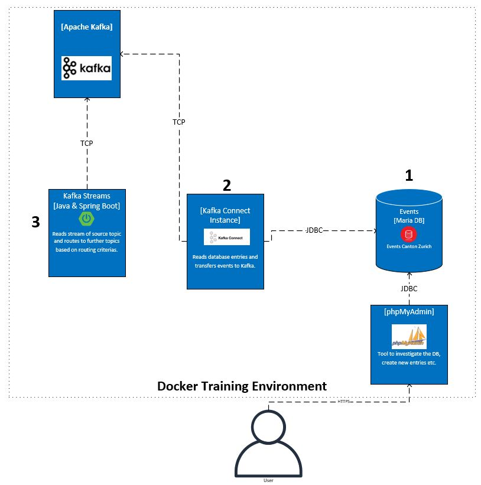

# Witness Protection

## Scenario in short
* A **double agent** moves to canton Zurich and start to work for an underground organisation based in **Langstrasse**. His goal is to collect evidence to put them in jail. Afterwards he needs witness protection and none of his data should be available.
* On his journey the double agent is generating events in the canton like **moving**, **marriage**, etc. which are stored in a traditional database using the Swiss **ech20** standard defined in XML.
* You work for the canton Zurich as an IT professional and your task is to ingest and process the canton events with Kafka. 

## Initial Setup
* There is a MariaDB database prepared with test data.
* The database contains simplified events based on Swiss **eCH-0020** standard in XML.
* The folder **uc-witness-protection** contains the source for Kafka streams and material to support the exercises.
* The Docker container **kafka-connect-01** contains Kafka Connect and is utilised in this exercise.



## Exercises

### Exercise 0: Connect the database to Kafka

Goals:

* Use Kafka connect to store database rows as events in a Kafka topics
* Learn about setting up the first JDBC connector and become familiar with the RESTful API
* See a connector in action

Exercise:

* Open http://localhost:8085/ to explore the data in the database.
 💡 To Login please  the field for the server blank and type for the **username** and **password** "**kafka-training**".
* Use the template [Exercise0jdbc-connector.json](/uc-witness-protection/connectors/Exercise0jdbc-connector.json) to create a Kafka connector sending a post request with the tool of your choice (curl, Postman,etc.).
* Discover the created events in Kafka via your preferred way.
* Create new test events with pypMyAdmin. It is enough to type random information for the filed "XML_EVENT".
* Why is this configuration not the most suitable for our scenario?
* Bonus: The utilised JDBC connector "JdbcSourceConnector" is not a standard within the container **kafka-connect-01** . Can you figure out from where it is and how we added it?

Hints:

* If you get stuck, check the status of your connector. 
* It might be necessary to restart the Kafka Connect. This can be done by the following command: **docker restart kafka-connect-01**
* How to add content in a database table can be found here https://www.siteground.com/tutorials/phpmyadmin/create-populate-tables/

Links:

* https://www.confluent.io/blog/kafka-connect-deep-dive-jdbc-source-connector
💡 If you prefer the console to access the databases use the following command
```
mysql --protocol=TCP -u kafka-training -pkafka-training events
```

### Exercise 1: Alter the connector configuration so that it works appropriate

Goals:

* New events in the database will be only transferred once to Kafka.
* Learning to alter the configuration.

Exercise:

* Update your existing connector with a put request so that new database entries are only synchronised once.
* Clean your existing topic so that there is no previous data inside.
* Create a new database entry based on the event template [Exercise1demo-event.xml](/uc-witness-protection/connectors/Exercise1demo-event.xml) using the filed "XML_EVENT".

Hints:

* The ID column of the table plays an important part for this exercise.

Links:

* https://www.confluent.io/blog/kafka-connect-deep-dive-jdbc-source-connector/#incremental-ingest

💡 If you prefer the console to access to the databases: mysql --protocol=TCP -u kafka-training -pkafka-training events


### Exercise 2: Consume the events with consumer groups

Goals:

* Share the data of one topic between two consumer.
* Learn how to utilise Kafka mechanism for horizontal scaling with consumer groups.

Exercise:

* Use the topic **mysql-01-events** and make sure the partitions fulfill the requirement of two consumer. 
* Distribute the events for two consumer so that one consumer does not see event of the other consumer.
* Generate test events to simulate the distribution of events.

Hints:
* You should  re-create the topic for new configuration.

Links:
* https://docs.confluent.io/platform/current/clients/consumer.html

### Exercise 3: Using a kafka message key
Goals:
* Configuring a Kafka message key for the events.
* The key will later be used to identify the person. 

Exercise:
* Alter the current connector using a key message.
* For message key should the column **PERSON_IDENTIFIER** from the database be used.
* Generate demo data using different values for **PERSON_IDENTIFIER**. Define one identifier for our double agent.

Links:
* https://www.confluent.io/blog/kafka-connect-deep-dive-jdbc-source-connector/#setting-kafka-message-key
* https://docs.confluent.io/platform/current/installation/configuration/topic-configs.html

### Exercise 4: Use Kafka streams to forward the events to tax department

Goals:
* Include Kafka streams to the existing environment.
* Create a topic for the tax department and forward every event which contains "<eCH-0020:moveIn>" to the new topic.

Exercise:

* Create a new topic for the tax department with the name **"tax-department"**
* Use the template [Exercise4Stream.java](uc-witness-protection/kafka-stream/src/main/java/com/zuehlke/training/kafka/witnessprotection/broker/stream/Exercise4Stream.java) to implement a stream
* Run the application and check the log output
* Generate events which fulfill the criteria to be in the topics **"tax-department"** and some who doesn't.

Hints:

* Check the course material of the iot use case if you need to refresh your knowledge about streams.

Links:
* https://developer.confluent.io/tutorials/filter-a-stream-of-events/confluent.html

### Exercise 5: Compacting + Tombstone Message
The double agent is done with his job. We need to remove all events related to his Kafka Message Key.

Goals:
* Familiarise with topic configuring and define an appropriate configuration for compacting 
* Using a tombstone message to remove all messages for a specific key.

Exercise:
* Recap yourself with the given attributes. cleanup.policy, delete.retention.ms, max.compaction.lag.ms , segment.ms 
* Config the topic for compacting using the above-mentioned configuration. The attributes can be changed via akHQ UI. 
* Using the tool **kafkacat** to send a Tombstone message. The Kafka console producer cannot generate empty messages.

Hint:
* After sending the tombstone message a final normal message with key and value required.
* Examples for kafkacat are given below.

```
# Install on Ubutntu 
sudo apt install kafkacat

# Mac
brew install kcat

# Sending an empty message for the topic mysql-01-events.
echo "key:" | kafkacat -b localhost -t mysql-01-events  -Z -K:
```

* Links:
* https://kafka.apache.org/documentation.html#compaction
* https://medium.com/@damienthomlutz/deleting-records-in-kafka-aka-tombstones-651114655a16
* https://docs.confluent.io/platform/current/installation/configuration/topic-configs.html
* http://cloudurable.com/blog/kafka-architecture-log-compaction/index.html

